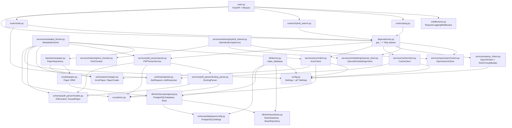

# Project Map — Arxiv Paper Curator

A mind map of the `src/` codebase: what each file does, what it imports, and
what imports it. Use this to trace dependencies when a change in one file
ripples into others.

> Mental model: dependencies flow **downward**. Foundation modules at the
> bottom know nothing about the layers above them. The orchestrator
> (`metadata_fetcher.py`) wires the **write** path; routers + `dependencies.py`
> wire the **read** path.

---

## 0. Per-folder deep dives

For a focused explanation of one area, jump straight to its README. Each
covers: what the folder does, file-by-file roles, internal connections,
and dependencies in/out.

| Folder | What it owns | Doc |
|---|---|---|
| `src/db/` | Database connection lifecycle, SQLAlchemy `Base` | [db/README](src/db/README.md) |
| `src/models/` | ORM table definitions | [models/README](src/models/README.md) |
| `src/repositories/` | Data access (the only place that queries Postgres) | [repositories/README](src/repositories/README.md) |
| `src/schemas/` | Pydantic data shapes for validation and boundaries | [schemas/README](src/schemas/README.md) |
| `src/services/` | Business logic + external integrations (top-level + 7 sub-services) | [services/README](src/services/README.md) |
| `src/services/arxiv/` | arxiv API client + PDF download with rate limiting | [services/arxiv/README](src/services/arxiv/README.md) |
| `src/services/pdf_parser/` | Docling-backed PDF parsing | [services/pdf_parser/README](src/services/pdf_parser/README.md) |
| `src/services/opensearch/` | Search index client, BM25 + hybrid search, query builder deep dive | [services/opensearch/README](src/services/opensearch/README.md) |
| `src/services/embeddings/` | OpenAI embeddings client (auto-batched) | [services/embeddings/README](src/services/embeddings/README.md) |
| `src/services/indexing/` | Section-aware chunker + hybrid indexer (chunk → embed → bulk-index) | _README TBD_ |
| `src/services/openai_/` | OpenAI chat-completion client + RAG prompt builder | _README TBD_ |
| `src/services/cache/` | Redis exact-match cache for `/ask` | _README TBD_ |
| `src/routers/` | FastAPI route handlers (ping, hybrid_search, ask) | _README TBD_ |

---

## 1. Layered architecture (who depends on whom)

```
┌─────────────────────────────────────────────────────────────┐
│ ENTRYPOINTS                                                   │
│   src/main.py — FastAPI app (lifespan + middleware + routers) │
│   airflow/dags/arxiv_paper_ingestion_and_indexing.py          │
│   airflow/dags/arxiv_ingestion/{common,fetching,setup,        │
│                                  reporting,indexing}.py       │
└─────────────────────────────────────────────────────────────┘
                              │
┌─────────────────────────────────────────────────────────────┐
│ ROUTERS  (FastAPI handlers — the read path)                   │
│   src/routers/ping.py            — health check               │
│   src/routers/hybrid_search.py   — BM25 + vector + RRF        │
│   src/routers/ask.py             — RAG Q&A (cache → retrieve  │
│                                    → LLM → answer)            │
│   src/routers/agentic_ask.py     — stub (planned, week 7)     │
└─────────────────────────────────────────────────────────────┘
                              │
┌─────────────────────────────────────────────────────────────┐
│ DEPENDENCY INJECTION                                          │
│   src/dependencies.py                                         │
│     get_*() resolvers + Annotated *Dep aliases                │
│     (OpenSearchDep, EmbeddingsDep, LLMDep, CacheDep, …)       │
└─────────────────────────────────────────────────────────────┘
                              │
┌─────────────────────────────────────────────────────────────┐
│ ORCHESTRATOR  (write path)                                    │
│   src/services/metadata_fetcher.py   ← the ingestion hub      │
│     MetadataFetcher + make_metadata_fetcher()                 │
└─────────────────────────────────────────────────────────────┘
        │                  │                    │
┌─────────────────────┐ ┌────────────────┐ ┌─────────────────┐
│ SERVICES            │ │ REPOSITORIES   │ │ DB              │
│ arxiv/              │ │ repositories/  │ │ db/factory      │
│ pdf_parser/         │ │   paper.py     │ │ db/interfaces/  │
│ opensearch/         │ │ (PaperRepo)    │ │   base,         │
│ embeddings/         │ │                │ │   postgresql    │
│ indexing/           │ │                │ │                 │
│ openai_/            │ │                │ │                 │
│ cache/              │ │                │ │                 │
└─────────────────────┘ └────────────────┘ └─────────────────┘
        │                  │                    │
┌─────────────────────────────────────────────────────────────┐
│ FOUNDATION (imported widely, import nothing internal)         │
│   src/config.py        — settings (all *Settings classes)     │
│   src/exceptions.py    — all custom exception types           │
│   src/middlewares.py   — RequestLoggingMiddleware             │
│   src/models/paper.py  — SQLAlchemy ORM table `Paper`         │
│   src/schemas/api/ask.py           — AskRequest, AskResponse  │
│   src/schemas/arxiv/paper.py       — ArxivPaper, PaperCreate  │
│   src/schemas/pdf_parser/models.py — PdfContent, ParsedPaper… │
│   src/schemas/database/config.py   — PostgreSQLSettings       │
└─────────────────────────────────────────────────────────────┘
```

---

## 2. Dependency graph (mermaid — renders in GitHub/VS Code)



---

## 3. Per-file reference: imports ↓ / imported-by ↑

Foundation files first (most depended-on), entrypoints last.

### `src/config.py`  — settings
- **Defines:** `Settings`, `get_settings()`, plus per-domain `*Settings` (`ArxivSettings`, `PDFParserSettings`, `OpenSearchSettings`, `OpenAIEmbeddingsSettings`, `OpenAIClientSettings`, `RedisSettings`)
- **Imports (internal):** none
- **Imported by:** `db/factory`, `dependencies`, `services/arxiv/*`, `services/pdf_parser/factory`, `services/opensearch/factory`, `services/embeddings/factory`, `services/indexing/factory`, `services/openai_/factory`, `services/cache/factory`, `services/metadata_fetcher`

### `src/exceptions.py`  — error types
- **Defines:** all `*Exception` / `*Error` classes (Arxiv, PDF, Repository, Metadata…)
- **Imports (internal):** none
- **Imported by:** `services/arxiv/client`, `services/pdf_parser/parser`, `services/pdf_parser/docling_parser`, `services/metadata_fetcher`

### `src/middlewares.py`  — HTTP middleware
- **Defines:** `RequestLoggingMiddleware` (logs method/path/status/duration per request)
- **Imports (internal):** none
- **Imported by:** `main`

### `src/schemas/api/ask.py`  — RAG API contracts
- **Defines:** `AskRequest` (query, top_k, use_hybrid, categories), `AskResponse` (query, answer, sources, chunks_used, search_mode)
- **Imports (internal):** none
- **Imported by:** `routers/ask`, `services/cache/client`

### `src/schemas/arxiv/paper.py`  — arxiv data shapes
- **Defines:** `ArxivPaper`, `PaperBase`, `PaperCreate`
- **Imports (internal):** none
- **Imported by:** `repositories/paper`, `services/arxiv/client`, `services/metadata_fetcher`

### `src/schemas/pdf_parser/models.py`  — parsed-PDF shapes
- **Defines:** `ParserType`, `PaperSection`, `PaperFigure`, `PaperTable`, `PdfContent`, `ArxivMetadata`, `ParsedPaper`
- **Imports (internal):** none
- **Imported by:** `services/pdf_parser/parser`, `services/pdf_parser/docling_parser`, `services/metadata_fetcher`

### `src/schemas/database/config.py`  — DB settings
- **Defines:** `PostgreSQLSettings`
- **Imports (internal):** none
- **Imported by:** `db/factory`, `db/interfaces/postgresql`

### `src/db/interfaces/base.py`  — DB abstractions
- **Defines:** `BaseDatabase` (ABC), `BaseRepository` (ABC)
- **Imports (internal):** none
- **Imported by:** `db/interfaces/postgresql`, `db/factory`, `dependencies`

### `src/db/interfaces/postgresql.py`  — Postgres impl + ORM Base
- **Defines:** `PostgreSQLDatabase`, `Base` (`declarative_base()`)
- **Imports:** `db/interfaces/base`, `schemas/database/config`
- **Imported by:** `db/factory`, `models/paper`

### `src/models/paper.py`  — ORM table
- **Defines:** `Paper(Base)`
- **Imports:** `db/interfaces/postgresql` (`Base`)
- **Imported by:** `repositories/paper`
- ⚠️ See gotcha #1 below — `Paper` must be imported before `create_all` runs.

### `src/db/factory.py`  — DB constructor
- **Defines:** `make_database() -> BaseDatabase`
- **Imports:** `config`, `db/interfaces/base`, `db/interfaces/postgresql`, `schemas/database/config`
- **Imported by:** `main`, notebooks

### `src/repositories/paper.py`  — data access
- **Defines:** `PaperRepository`
- **Imports:** `models/paper`, `schemas/arxiv/paper`
- **Imported by:** `services/metadata_fetcher`

### `src/services/arxiv/client.py`  — arxiv API client
- **Defines:** `ArxivClient`
- **Imports:** `config` (`ArxivSettings`), `exceptions`, `schemas/arxiv/paper`
- **Imported by:** `services/arxiv/factory`, `services/metadata_fetcher`, `dependencies`

### `src/services/arxiv/factory.py`
- **Defines:** `make_arxiv_client() -> ArxivClient`
- **Imports:** `config`, `.client`
- **Imported by:** `main`, Airflow DAG common

### `src/services/pdf_parser/docling_parser.py`  — Docling backend
- **Defines:** `DoclingParser`
- **Imports:** `exceptions`, `schemas/pdf_parser/models`
- **Imported by:** `services/pdf_parser/parser`

### `src/services/pdf_parser/parser.py`  — parser facade
- **Defines:** `PDFParserService`
- **Imports:** `exceptions`, `schemas/pdf_parser/models`, `.docling_parser`
- **Imported by:** `services/pdf_parser/factory`, `services/metadata_fetcher`, `dependencies`

### `src/services/pdf_parser/factory.py`
- **Defines:** `make_pdf_parser_service() -> PDFParserService`
- **Imports:** `config`, `.parser`
- **Imported by:** `main`, Airflow DAG common

### `src/services/opensearch/index_config_hybrid.py`  — index schema + RRF pipeline
- **Defines:** `ARXIV_PAPERS_CHUNKS_INDEX`, `ARXIV_PAPERS_CHUNKS_MAPPING`, `HYBRID_RRF_PIPELINE`
- **Imports (internal):** none — pure data dicts
- **Imported by:** `services/opensearch/client`

### `src/services/opensearch/query_builder.py`  — query DSL builder
- **Defines:** `QueryBuilder` (`.build()` produces the OpenSearch search body)
- **Imports (internal):** none
- **Imported by:** `services/opensearch/client`

### `src/services/opensearch/client.py`  — OpenSearch wrapper
- **Defines:** `OpenSearchClient` (setup, index, search BM25/vector/hybrid, delete)
- **Imports:** `config`, `.index_config_hybrid`, `.query_builder`
- **Imported by:** `services/opensearch/factory`, `services/indexing/hybrid_indexer`, `dependencies`

### `src/services/opensearch/factory.py`
- **Defines:** `make_opensearch_client()` (cached singleton)
- **Imports:** `config`, `.client`
- **Imported by:** `main`, Airflow DAG common

### `src/services/embeddings/openai_client.py`  — embeddings client
- **Defines:** `OpenAIEmbeddingsClient` (`embed_text`, `embed_batch` with auto-batching)
- **Imports:** `config` (`OpenAIEmbeddingsSettings`)
- **Imported by:** `services/embeddings/factory`, `services/indexing/hybrid_indexer`, `dependencies`

### `src/services/embeddings/factory.py`
- **Defines:** `make_openai_embeddings_client()` (cached singleton, optional settings override)
- **Imports:** `config`, `.openai_client`
- **Imported by:** `main`

### `src/services/indexing/text_chunker.py`  — section-aware chunker
- **Defines:** `TextChunker` (splits a `ParsedPaper` into ~500-word chunks with overlap)
- **Imports:** `schemas/pdf_parser/models`
- **Imported by:** `services/indexing/hybrid_indexer`

### `src/services/indexing/hybrid_indexer.py`  — chunk → embed → index
- **Defines:** `HybridIndexingService` (orchestrates chunker + embeddings + OpenSearch bulk index)
- **Imports:** `services/opensearch/client`, `services/embeddings/openai_client`, `.text_chunker`, `schemas/pdf_parser/models`
- **Imported by:** `services/indexing/factory`, Airflow DAG indexing task

### `src/services/indexing/factory.py`
- **Defines:** `make_hybrid_indexer()`
- **Imports:** `services/opensearch/factory`, `services/embeddings/factory`, `.hybrid_indexer`
- **Imported by:** Airflow DAG common

### `src/services/openai_/client.py`  — chat-completion client + RAG prompt
- **Defines:** `OpenAIClient` (`generate_rag_response(query, chunks)`), `RAGPromptBuilder`, `ResponseParser`
- **Imports:** `config` (`OpenAIClientSettings`), `.prompts` (system prompt text)
- **Imported by:** `services/openai_/factory`, `dependencies`

### `src/services/openai_/factory.py`
- **Defines:** `make_openai_client()` (cached singleton)
- **Imports:** `config`, `.client`
- **Imported by:** `main`

### `src/services/cache/client.py`  — Redis exact-match cache
- **Defines:** `CacheClient` (`find_cached_response`, `store_response`, `_generate_cache_key`)
- **Imports:** `config` (`RedisSettings`), `schemas/api/ask` (`AskRequest`, `AskResponse`)
- **Imported by:** `services/cache/factory`, `dependencies`

### `src/services/cache/factory.py`
- **Defines:** `make_redis_client(settings)`, `make_cache_client(settings)` — course-style explicit-DI factory (no `@lru_cache`); singleton enforced at the caller (`lifespan`)
- **Imports:** `config`, `.client`
- **Imported by:** `main`

### `src/services/metadata_fetcher.py`  — ★ INGESTION ORCHESTRATOR
- **Defines:** `MetadataFetcher`, `make_metadata_fetcher(...)`
- **Imports:** `config`, `exceptions`, `repositories/paper`, `schemas/arxiv/paper`, `schemas/pdf_parser/models`, `services/arxiv/client`, `services/pdf_parser/parser`
- **Imported by:** Airflow DAG common (via `make_metadata_fetcher`)

### `src/dependencies.py`  — FastAPI DI layer
- **Defines:** `get_*()` resolvers (read services from `request.app.state`) and `Annotated[T, Depends(...)]` aliases — `SettingsDep`, `DatabaseDep`, `SessionDep`, `OpenSearchDep`, `ArxivDep`, `PDFParserDep`, `EmbeddingsDep`, `LLMDep`, `CacheDep`
- **Imports:** `config`, `db/interfaces/base`, every service client class
- **Imported by:** every router

### `src/routers/ping.py`  — health check
- **Defines:** `router` with `GET /ping`; checks OpenSearch + index counts
- **Imports:** `dependencies` (`OpenSearchDep`, `SettingsDep`)
- **Imported by:** `main`

### `src/routers/hybrid_search.py`  — retrieval endpoint
- **Defines:** `router` with `POST /hybrid_search`; embeds query (if hybrid) + calls `OpenSearchClient.search_unified`
- **Imports:** `dependencies` (`OpenSearchDep`, `EmbeddingsDep`)
- **Imported by:** `main`

### `src/routers/ask.py`  — RAG Q&A endpoint
- **Defines:** `router` with `POST /ask`; cache lookup → embed → retrieve → LLM → cache store
- **Imports:** `dependencies` (`OpenSearchDep`, `EmbeddingsDep`, `LLMDep`, `CacheDep`), `schemas/api/ask`
- **Imported by:** `main`

### `src/routers/agentic_ask.py`  — stub (planned, week 7)
- **Defines:** placeholder router for agentic retrieval (LangGraph). Not wired yet.

### `src/main.py`  — FastAPI entrypoint
- **Defines:** `app`, `lifespan` (builds singletons → `app.state`), middleware registration, router includes (`/api/v1/*`)
- **Imports:** `config`, `db/factory`, `middlewares`, every service factory, every router
- **Run with:** `uvicorn src.main:app --reload` (or via Docker `api` service)

---

## 4. Runtime data flows

### Write path (Airflow DAG, scheduled)

```
arxiv API ──> ArxivClient ──> ArxivPaper
                                   │
PDF file ──> PDFParserService ──> DoclingParser ──> ParsedPaper
                                   │
                                   ▼
                          MetadataFetcher  (combines metadata + parsed content)
                                   │
                                   ├──> PaperRepository.upsert(PaperCreate)
                                   │         │
                                   │         ▼
                                   │    Postgres papers table
                                   │
                                   └──> HybridIndexingService
                                          │
                                  TextChunker ──> chunks (~500 words)
                                  Embeddings ──> 1024-dim vectors
                                  OpenSearch ──> arxiv-papers-chunks index
```

### Read path (FastAPI, per-request)

```
HTTP POST /api/v1/ask {query, top_k, use_hybrid, categories}
        │
        ▼
RequestLoggingMiddleware (log start)
        │
        ▼
Router ask.py
        │
        ├─[0]─> CacheClient.find_cached_response(request)
        │            │
        │            └── HIT?  ──> return AskResponse  (skip everything below)
        │
        ├─[1]─> EmbeddingsClient.embed_text(query)         (if use_hybrid)
        ├─[2]─> OpenSearchClient.search_unified(...)       (BM25 + k-NN + RRF in OS)
        ├─[3]─> OpenAIClient.generate_rag_response(query, chunks)
        ├─[4]─> CacheClient.store_response(request, response)
        └─[5]─> return AskResponse {query, answer, sources, chunks_used, search_mode}
```

The `factory.py` files (`make_*`) exist so callers build a fully-wired object
without knowing its dependencies — the standard construction seam for this repo.
`dependencies.py` is the FastAPI-specific version: turns "service stored on
app.state" into a typed parameter routers can declare.

---

## 5. Gotchas worth remembering

1. **ORM table registration order.** `Base` lives in
   `db/interfaces/postgresql.py`; the `Paper` table only attaches to that
   `Base` when `models/paper.py` is imported. So you must
   `from src.models.paper import Paper` *before* calling `create_all` /
   `make_database()`, or the `papers` table won't exist. This still bites
   notebooks regularly.

2. **All package directories have `__init__.py`.** Earlier versions relied
   on namespace-package behavior; everything is now an explicit package so
   pytest collection and packaging tools behave predictably.

3. **Indentation bugs disguised as logic bugs.** Several files in this repo
   have shipped with `return` statements nested inside `if` blocks, methods
   detached from their class, and dict comprehensions stuck inside loops.
   `python -m py_compile` will pass even when the logic is wrong — so after
   any non-trivial edit, **read the indentation carefully** around
   `if`/`try`/`for` blocks. Past examples: `setup.py` 5-vs-4-tuple unpack,
   `opensearch/factory.py` `return` inside `if settings is None:`,
   multiple `_search_*` methods returning early on the first iteration.

4. **Cache degrades gracefully.** `main.py`'s lifespan wraps
   `make_cache_client(...)` in a `try/except` — if Redis is down at startup,
   `app.state.cache = None` and the API still serves `/ask` (uncached).
   `CacheDep` is typed `CacheClient | None`; the router checks `is not None`
   before calling cache methods. **Don't change `CacheDep` to non-Optional
   without removing the graceful-degrade path.**

5. **Hostnames differ between Mac and containers.** From inside the API
   container, services are reached by their compose service name
   (`postgres`, `redis`, `opensearch`). From your Mac (notebooks, curl),
   they're at `localhost:<port>`. The `.env` defaults and the
   `docker-compose.yml` `environment:` overrides handle this — don't
   hardcode either form in code; read from settings.

6. **Cache key MUST include every param that changes the answer.**
   `_generate_cache_key` hashes `query` (normalized) + `top_k` + `use_hybrid`
   + `categories`. If you add a new request param (e.g. a model override or
   a reranker flag), add it to the key or you'll serve wrong results.

7. **Arxiv rate limiting (HTTP 429).** Arxiv enforces ~1 req per 3s. The
   client respects it within a run, but cumulative requests across runs in a
   short window (notebook tests + DAG triggers) will get you banned for
   several minutes. Don't auto-retry harder — wait and try again later.

---
*Regenerate this map after adding modules or changing import wiring.*
