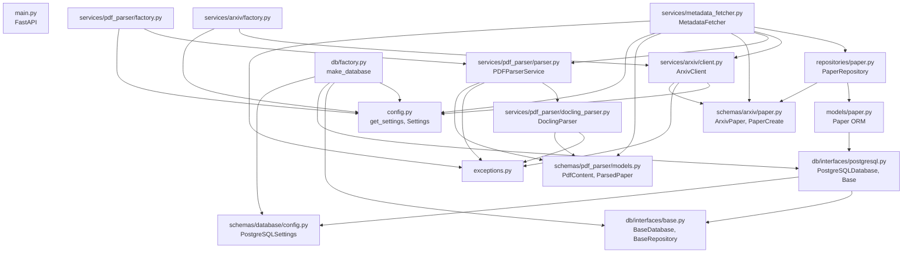

# Project Map — Arxiv Paper Curator

A mind map of the `src/` codebase: what each file does, what it imports, and
what imports it. Use this to trace dependencies when a change in one file
ripples into others.

> Mental model: dependencies flow **downward**. Foundation modules at the
> bottom know nothing about the layers above them. The orchestrator at the top
> (`metadata_fetcher.py`) wires everything together.

---

## 1. Layered architecture (who depends on whom)

```
┌─────────────────────────────────────────────────────────────┐
│ ENTRYPOINTS                                                   │
│   src/main.py (FastAPI app)                                   │
│   airflow/dags/arxiv_ingestion/* (DAG stubs — currently EMPTY)│
└─────────────────────────────────────────────────────────────┘
                              │
┌─────────────────────────────────────────────────────────────┐
│ ORCHESTRATOR                                                  │
│   src/services/metadata_fetcher.py   ← the hub                │
│     MetadataFetcher + make_metadata_fetcher()                 │
└─────────────────────────────────────────────────────────────┘
        │                  │                    │
┌───────────────┐ ┌────────────────┐ ┌────────────────────────┐
│ SERVICES      │ │ REPOSITORIES   │ │ DB                      │
│ arxiv/client  │ │ repositories/  │ │ db/factory             │
│ pdf_parser/   │ │   paper.py     │ │ db/interfaces/         │
│   parser      │ │ (PaperRepo)    │ │   base, postgresql     │
│   docling     │ │                │ │                        │
└───────────────┘ └────────────────┘ └────────────────────────┘
        │                  │                    │
┌─────────────────────────────────────────────────────────────┐
│ FOUNDATION (imported widely, import nothing internal)         │
│   src/config.py        — settings (Arxiv, PDFParser, DB)      │
│   src/exceptions.py    — all custom exception types           │
│   src/models/paper.py  — SQLAlchemy ORM table `Paper`         │
│   src/schemas/arxiv/paper.py       — ArxivPaper, PaperCreate  │
│   src/schemas/pdf_parser/models.py — PdfContent, ParsedPaper… │
│   src/schemas/database/config.py   — PostgreSQLSettings       │
└─────────────────────────────────────────────────────────────┘
```

---

## 2. Dependency graph (mermaid — renders in GitHub/VS Code)



---

## 3. Per-file reference: imports ↓ / imported-by ↑

Foundation files first (most depended-on), orchestrator last.

### `src/config.py`  — settings
- **Defines:** `Settings`, `ArxivSettings`, `PDFParserSettings`, `get_settings()`
- **Imports (internal):** none
- **Imported by:** `db/factory`, `services/arxiv/client`, `services/arxiv/factory`, `services/pdf_parser/factory`, `services/metadata_fetcher`

### `src/exceptions.py`  — error types
- **Defines:** all `*Exception` / `*Error` classes (Arxiv, PDF, Repository, Metadata…)
- **Imports (internal):** none
- **Imported by:** `services/arxiv/client`, `services/pdf_parser/parser`, `services/pdf_parser/docling_parser`, `services/metadata_fetcher`

### `src/schemas/arxiv/paper.py`  — arxiv data shapes
- **Defines:** `ArxivPaper`, `PaperBase`, `PaperCreate`
- **Imports (internal):** none
- **Imported by:** `repositories/paper`, `services/arxiv/client`, `services/metadata_fetcher`

### `src/schemas/pdf_parser/models.py`  — parsed-PDF shapes
- **Defines:** `ParserType`, `PaperSection`, `PaperFigure`, `PaperTable`, `PdfContent`, `ArxivMetadata`, `ParsedPaper`
- **Imports (internal):** none
- **Imported by:** `services/pdf_parser/parser`, `services/pdf_parser/docling_parser`, `services/metadata_fetcher`

### `src/schemas/database/config.py`  — DB settings
- **Defines:** `PostgreSQLSettings`
- **Imports (internal):** none
- **Imported by:** `db/factory`, `db/interfaces/postgresql`

### `src/db/interfaces/base.py`  — DB abstractions
- **Defines:** `BaseDatabase` (ABC), `BaseRepository` (ABC)
- **Imports (internal):** none
- **Imported by:** `db/interfaces/postgresql`, `db/factory`

### `src/db/interfaces/postgresql.py`  — Postgres impl + ORM Base
- **Defines:** `PostgreSQLDatabase`, `Base` (`declarative_base()`)
- **Imports:** `db/interfaces/base` (`BaseDatabase`), `schemas/database/config` (`PostgreSQLSettings`)
- **Imported by:** `db/factory`, `models/paper` (for `Base`)

### `src/models/paper.py`  — ORM table
- **Defines:** `Paper(Base)`
- **Imports:** `db/interfaces/postgresql` (`Base`)
- **Imported by:** `repositories/paper`
- ⚠️ See gotcha #1 below — `Paper` must be imported before `create_all` runs.

### `src/db/factory.py`  — DB constructor
- **Defines:** `make_database() -> BaseDatabase`
- **Imports:** `config`, `db/interfaces/base`, `db/interfaces/postgresql`, `schemas/database/config`
- **Imported by:** (entrypoints / notebooks)

### `src/repositories/paper.py`  — data access
- **Defines:** `PaperRepository`
- **Imports:** `models/paper` (`Paper`), `schemas/arxiv/paper` (`PaperCreate`)
- **Imported by:** `services/metadata_fetcher`

### `src/services/arxiv/client.py`  — arxiv API client
- **Defines:** `ArxivClient`
- **Imports:** `config` (`ArxivSettings`), `exceptions`, `schemas/arxiv/paper` (`ArxivPaper`)
- **Imported by:** `services/arxiv/factory`, `services/metadata_fetcher`

### `src/services/arxiv/factory.py`
- **Defines:** `make_arxiv_client() -> ArxivClient`
- **Imports:** `config`, `.client`
- **Imported by:** (entrypoints)

### `src/services/pdf_parser/docling_parser.py`  — Docling backend
- **Defines:** `DoclingParser`
- **Imports:** `exceptions`, `schemas/pdf_parser/models`
- **Imported by:** `services/pdf_parser/parser`

### `src/services/pdf_parser/parser.py`  — parser facade
- **Defines:** `PDFParserService`
- **Imports:** `exceptions`, `schemas/pdf_parser/models` (`PdfContent`), `.docling_parser` (`DoclingParser`)
- **Imported by:** `services/pdf_parser/factory`, `services/metadata_fetcher`

### `src/services/pdf_parser/factory.py`
- **Defines:** `make_pdf_parser_service() -> PDFParserService`
- **Imports:** `config`, `.parser`
- **Imported by:** (entrypoints)

### `src/services/metadata_fetcher.py`  — ★ ORCHESTRATOR
- **Defines:** `MetadataFetcher`, `make_metadata_fetcher(...)`
- **Imports:** `config`, `exceptions`, `repositories/paper` (`PaperRepository`), `schemas/arxiv/paper`, `schemas/pdf_parser/models`, `services/arxiv/client` (`ArxivClient`), `services/pdf_parser/parser` (`PDFParserService`)
- **Imported by:** (entrypoints / DAGs once implemented)

### `src/main.py`  — FastAPI entrypoint
- **Defines:** `app`, `health()`
- **Imports (internal):** none yet (just `fastapi`)

---

## 4. Runtime data flow (the happy path)

```
arxiv API ──> ArxivClient ──> ArxivPaper schema
                                   │
PDF file ──> PDFParserService ──> DoclingParser ──> PdfContent / ParsedPaper
                                   │
                                   ▼
                          MetadataFetcher  (combines metadata + parsed content)
                                   │
                                   ▼
                          PaperRepository.create(PaperCreate)
                                   │
                                   ▼
                          PostgreSQLDatabase ──> papers table (Paper ORM)
```

The `factory.py` files (`make_*`) exist so callers build a fully-wired object
without knowing its dependencies — the standard construction seam for this repo.

---

## 5. Gotchas worth remembering

1. **ORM table registration order.** `Base` lives in
   `db/interfaces/postgresql.py`; the `Paper` table only attaches to that
   `Base` when `models/paper.py` is imported. So you must
   `from src.models.paper import Paper` *before* calling `create_all` /
   `make_database()`, or the `papers` table won't exist. (This is the exact
   issue seen in the arxiv-integration notebook.)

2. **`services/arxiv/` and `services/pdf_parser/` have no `__init__.py`** but
   use relative imports (`from .client import ...`). They work as namespace
   packages — keep that in mind if you reorganize.

3. **Airflow DAG files are empty stubs.**
   `airflow/dags/arxiv_ingestion/{common,fetching,indexing,reporting,setup}.py`
   are 0 bytes — the pipeline isn't wired into Airflow yet.

---
*Regenerate this map after adding modules or changing import wiring.*
